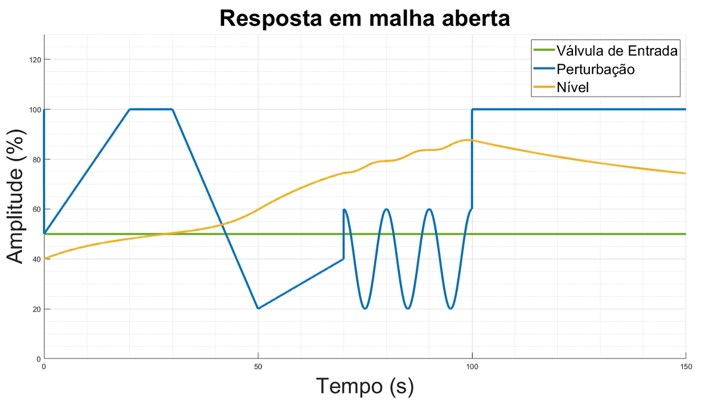
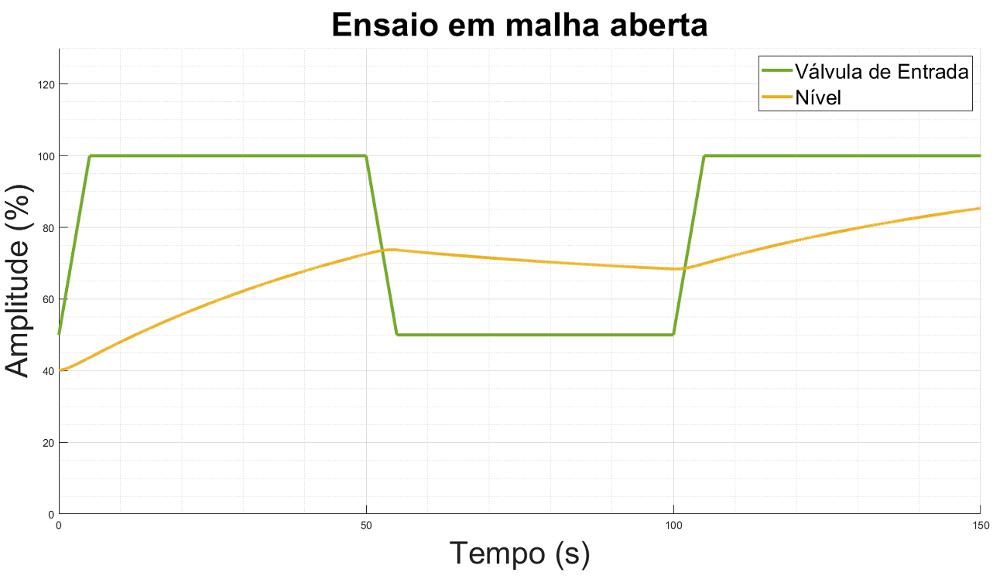

# Controle de Nível via UDP

## Descrição
Esse repositório contem o trabalho final da disciplinha ENG10048 - Protocolos de Comunicação - UFRGS cursada em 2022/1.
O trabalho foi proposto pelo professor Alceu Heinke Frigeri e desenvolvido pelos alunos Lucas Esteves e Vitor Carvalho.
Para mais detalhes, verifique o *.pdf* que contém a descrição do trabalho.

## Requisitos para compilação:

- POSIX
- SLD 1.2 (opcional)
- GCC >= 4.3

A biblioteca SDL 1.2 é necessária somente para executar o programa com a parte gráfica.

## Compilação 

### Completa

1. Navegue para o diretorio *src/main* e execute  o script *comp.sh*

#### Problemas comuns 
- Caso seja necessário, habilite as permissões para o *script* executando o comando: `chmod +x bash.sh`
- Caso a biblioteca SDL 1.2 não esteja sendo encontrada, ela pode ser facilmente instalada em distribuições que utilizam o gerenciador de pacotes **apt** utilizando o seguinte comando: `sudo apt install libsdl1.2-dev`

### Sem gráfico
1. Navegue para o diretorio *src/main*
2. Abra os arquivos *server.c* e *client.c*
3. Comente, em cada um dos arquivos, o comando `#define GRAPH 1` (linha **11** em ambos os arquivos) utilizando `//`
4. Compile o servidor utilizando os seguintes comandos: `gcc server.c -o server -pthread -lm -lrt`
5. Compile o cliente utilizando os seguintes comandos: `gcc client.c -o client -pthread -lm -lrt`

## Execução
### Completa 
1. Inicie o servidor rodando o comando `./server <porta>`
2. Inicie o cliente rodando o comando `./client <serverIP> <porta>`
3. Selecione o tipo de controlador desejado, na janela do cliente. Após pressione Enter
4. Quando desejar, encerre a janela gráfica do cliente para encerrar ambos os programas simultâneamente.

### Gráfica 
1. Execute os passos 1 - 3 da eexecução completa. 
2. Quando desejar, pressione Esc no cliente para encerrar ambos os programas simultâneamente

# Resultados 
Neste treço são apresentadas algumas capturas de telas  a respeito dos resultados obtidos.
## Sistema em Malha aberta
Na Figura 1, abaixo, é apresentado a resposta do sistema sem controlador. 

Fig.1 - Resposta do sistema sem controle.

Por sua vez, na Figura 2, é a apresentado o ensaio, sem pertubação, que foi efetuado para identificar (minimamente) características do processo para possibilitar seu controle.

Fig.2 - Ensaio para identificação do sistema

Com base nessas duas Figuras (Figura 1 e Figura 2) é possível verificar a necessiade do controlador e o como o sistema se comporta na presença de um acionamento 
## Resultados com controlador do Tipo Bang-Bang
### Sem perturbação de rede
Na Figura 3, abaixo, é possível observar o controle do processo com um controlador Bang-Bang e sem perturbação de rede. A janela da esquerda representa a vista do servidor, onde a planta é executada e a da direita a vista do cliente, que efetua o controle. Para a janela do servidor:
- Verde: abertura da válvula de entrada
- Azul: perturbação/ variação da válvula de saída
- Laranja: nivel do tanque  
Para a janela do cliente:
- Verde: abertura da válvula de entrada
- Azul: referência/nível desejado para o tanque
- Laranja: nível do tanque  

Fig.3 - Resposta com controlador Bang-Bang.

## Resultados com controlador do Tipo PID 
### Sem perturbação de rede
Na Figura 4, abaixo, é possível observar o controle do processo com um controlador PID e sem perturbação de rede. A janela da esquerda representa a vista do servidor, onde a planta é executada e a da direita a vista do cliente, que efetua o controle. Para a janela do servidor:
- Verde: abertura da válvula de entrada
- Azul: perturbação/ variação da válvula de saída
- Laranja: nivel do tanque  
Para a janela do cliente:
- Verde: abertura da válvula de entrada
- Azul: referência/nível desejado para o tanque
- Laranja: nível do tanque  

Fig.4 - Resposta com controlador PID.

